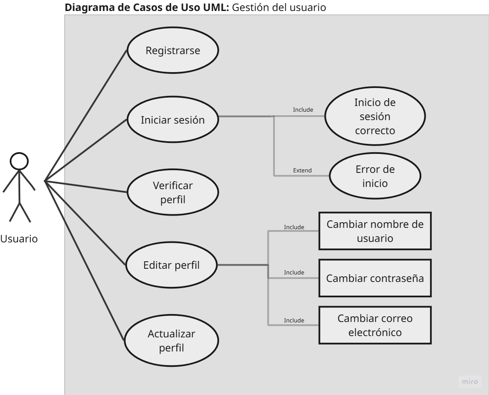
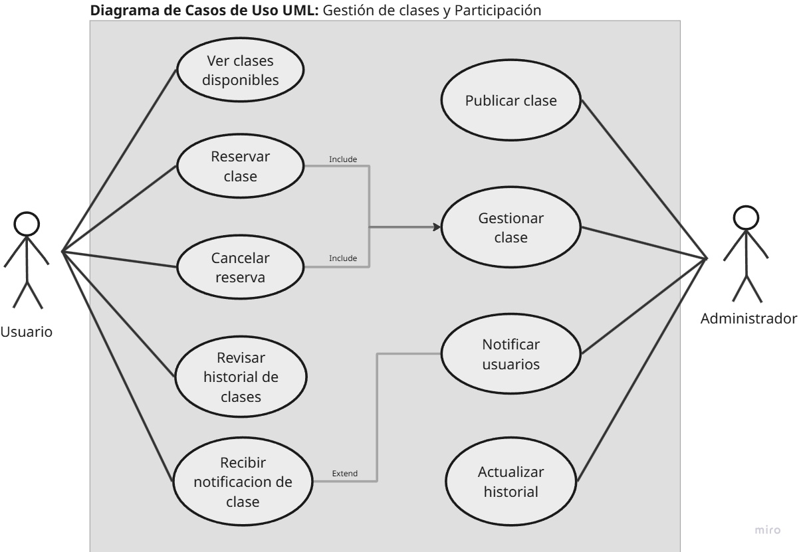

# DIAGRAMA DE CASOS DE USO UML: GYMAPP

## 📌 Diagrama de Casos de Uso: Gestión del Usuario

## 📌 Diagrama de Casos de Uso: Gestión del Administrador

## 📌 Diagrama de Casos de Uso: Gestión de Clases y Participación

